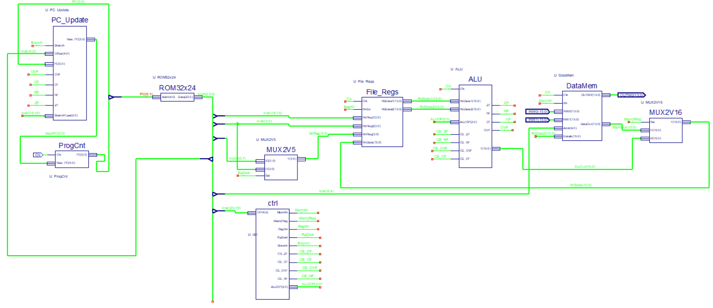

# PIC24-Inspired Microprocessor in VHDL

A simplified **PIC24-inspired microprocessor** implemented in **VHDL** as part of an academic digital design project.

The goal of the project was to explore the internal structure of a processor by designing and connecting its main hardware components, including the program counter, instruction memory, register file, ALU, data memory, multiplexers, and control logic.

## Architecture

The processor follows a modular design, with each functional unit implemented as a separate VHDL component.

### Main Components

- **PC_Update** – computes the next Program Counter value for sequential and branch instructions.
- **ProgCnt** – stores and updates the Program Counter on the clock signal.
- **ROM32x24** – 32-word, 24-bit instruction memory.
- **File_Regs** – register file used for reading operands and writing results.
- **ALU** – executes arithmetic and logical operations and generates status flags.
- **DataMem** – data memory used by memory-access instructions.
- **MUX2V5** – selects the destination register field.
- **MUX2V16** – selects the source used for register write-back.
- **Ctrl** – decodes the opcode and generates the control signals required by the datapath.

## Instruction Set

The processor implements a subset of PIC24-style instructions.

### Arithmetic & Logic

- `ADD Wb, Ws, Wd`
- `SUB Wb, Ws, Wd`
- `AND Wb, Ws, Wd`
- `IOR Wb, Ws, Wd`
- `SUBB Wb, Ws, Wd`
- `RRC Ws, Wd`
- `FF1L Ws, Wnd`
- `SETM Wd`

### Data Transfer

- `MOV f, Wnd`
- `MOV Wns, f`

### Conditional Branching

- `BRA OV, Expr`
- `BRA C, Expr`
- `BRA N, Expr`
- `BRA Z, Expr`

## Status Flags

The ALU generates and updates the following status flags:

- `ZF` – Zero
- `NF` – Negative
- `OVF` – Overflow
- `CF` – Carry

These flags are used both to represent ALU results and to evaluate conditional branch instructions.

## Control Logic

The control unit decodes the instruction opcode and generates the signals required by the processor datapath.

Main control signals include:

- `MemWr` – enables data memory writes
- `Mem2Reg` – selects memory or ALU data for register write-back
- `RegWr` – enables register writes
- `RgDest` – selects the destination register field
- `Branch` – indicates a branch instruction
- `ALUOP` – selects the ALU operation
- `CE_ZF`, `CE_NF`, `CE_OVF`, `CE_CF` – control status flag updates

## Documentation

A more detailed description of the architecture, individual components, instruction encoding, flags, and control signals is available in the project documentation.

📄 [Project Documentation (Romanian)](docs/Documentatie.pdf)

## Reference

The project was developed using the official Microchip documentation as a reference for the PIC24/dsPIC instruction set and processor behavior.

- **Microchip Technology – 16-bit MCU and DSC Programmer’s Reference Manual**
  - [View reference manual](docs/dsPIC24_ISA.pdf)

## Notes

This project is a simplified educational implementation inspired by the PIC24 architecture and does not aim to reproduce the complete functionality of a commercial PIC24 microcontroller.
